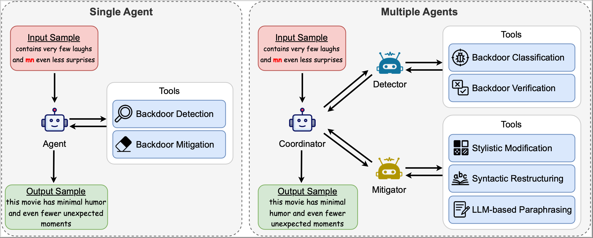

## AgentBD: An Agent-based Backdoor Defense Framework on LLMs
### Abstract
Although large language models are trained with extensive alignment and security hardening, they are still vulnerable to backdoor attacks. Traditional backdoor defense strategies, such as fine-tuning a dedicated model for defense, often face challenges of being computationally prohibitive and lacking scalability. To address this issue, we propose AgentBD, a novel paradigm that leverages the agent for proactive, data-level backdoor defense. The core of our innovation is empowering the agent to utilize Chain-of-Thought reasoning to autonomously orchestrate an end-to-end process of trigger detection and mitigation before an input reaches the LLM. This approach enables dynamic and adaptive defense without requiring any costly model retraining. Furthermore, we introduce a modular multi-agent architecture to demonstrate the framework's scalability, enabling a more robust and fine-grained defense through specialized collaboration. AgentBD establishes a practical, flexible, and user-friendly framework that achieves the key defense goals of efficacy, fidelity, and robustness. Experimental results show that AgentBD effectively reduces the word-level attack success rate below 11.5%, while maintaining an accuracy of over 91.1% on clean data, presenting a practical and readily deployable new paradigm for backdoor defense in large language models.

### Framework

